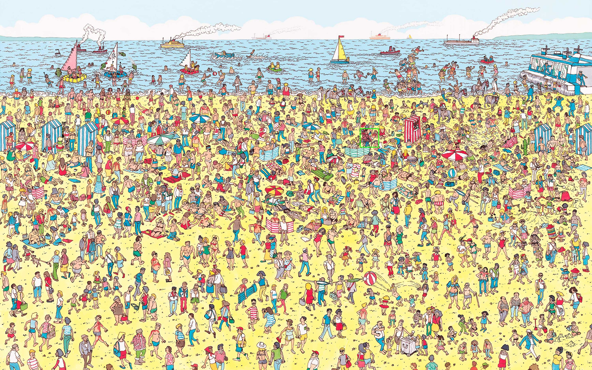
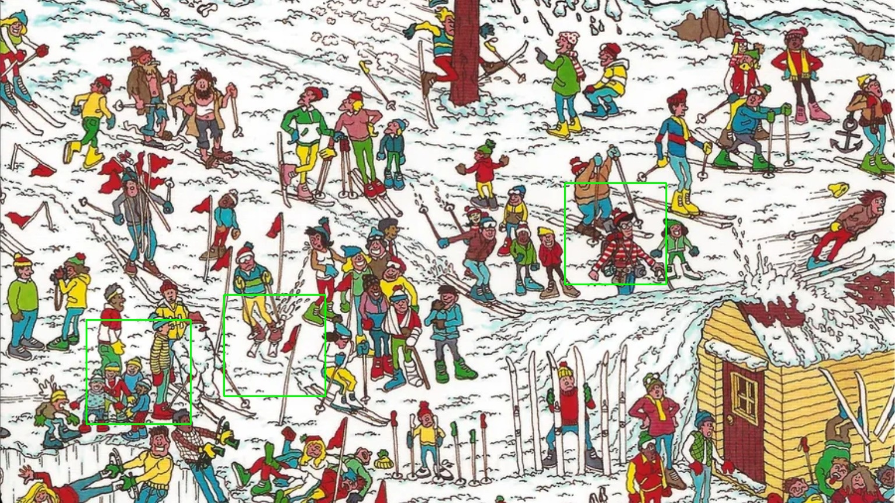
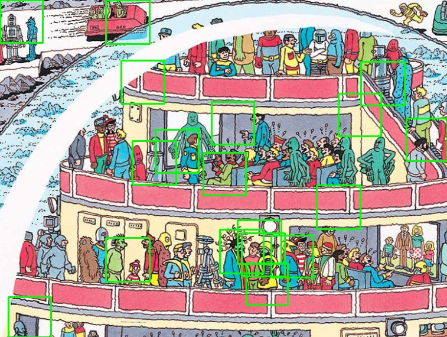
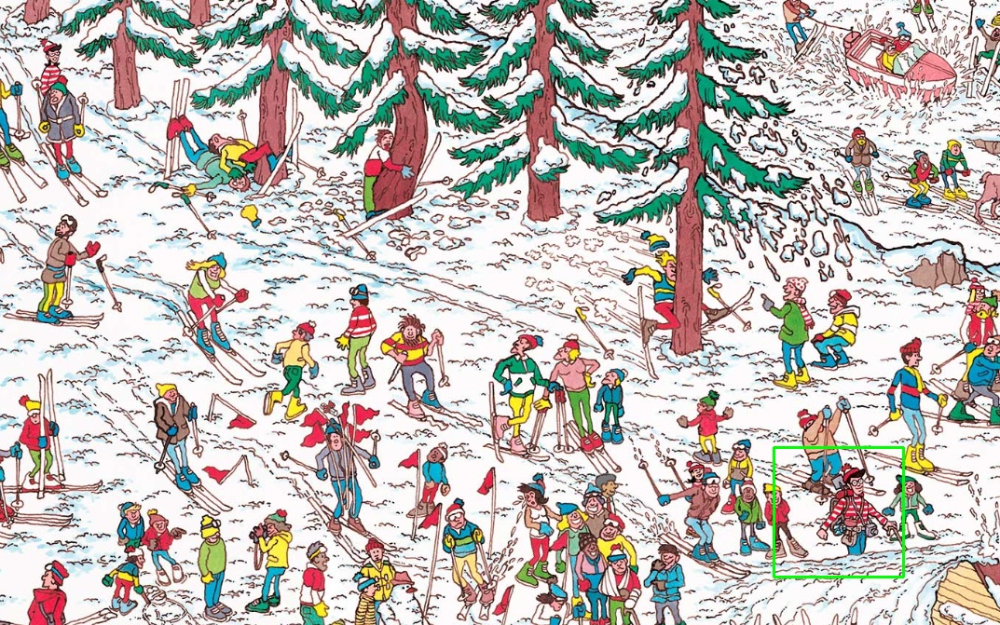

### Alumno: Axel Martin Vega Espinoza

# Encontrando a Wally

## Resumen

El desafío “¿Dónde está Wally?” es una actividad entretenida que pone a prueba la capacidad visual del jugador. El objetivo es simple: encontrar al escurridizo personaje Wally en una multitud de personas y escenarios caóticos. Aunque Wally a menudo se camufla hábilmente entre la multitud, su característico atuendo a rayas rojas y blancas lo delata.    

En esta actividad, utilizaremos el software Cascade Trainer GUI para entrenar un clasificador capaz de detectar a Wally en imágenes. Se han recopilado un conjunto de 300 imágenes etiquetadas como “positivas” (donde Wally está presente) y “negativas” (donde Wally no aparece). Con este conjunto de datos, crearemos un modelo que pueda identificar a Wally en nuevos escenarios.    

**¿Qué es Cascade Trainer GUI?**    
Cascade Trainer GUI es una herramienta que nos permite entrenar clasificadores basados en cascada utilizando el algoritmo de detección de objetos de OpenCV. Este algoritmo es especialmente útil para detectar objetos en imágenes con fondos complejos y variados.    

**Preparación del Conjunto de Datos**    
Antes de comenzar, es importante asegurarse de tener las imágenes etiquetadas correctamente como “positivas” o “negativas”. Las imágenes positivas deben contener a Wally, mientras que las negativas no deben incluirlo. Esto proporcionará al clasificador ejemplos claros de lo que estamos buscando.    

### Entrenamiento del Clasificador
1. **Instalación de Cascade Trainer GUI:** Descarga e instala Cascade Trainer GUI en tu sistema.    

2. **Configuración del Conjunto de Datos:** Carga las imágenes etiquetadas en la herramienta.

3. **Ajuste de Parámetros:** Experimenta con los parámetros del clasificador, como el número de etapas y la tasa de falsos positivos. Estos afectarán la precisión y velocidad del modelo.

4. **Entrenamiento:** Inicia el proceso de entrenamiento. El clasificador aprenderá a distinguir a Wally de otros elementos en las imágenes.

5. **Prueba:** Después del entrenamiento, prueba el modelo en nuevas imágenes.

## Resultados

Al poner a prueba el clasificador en imágenes de gran densidad de píxeles, la cantidad de coincidencia podía llegar a superar las 100, lo cual representaba un problema y un indicio de que a mi clasificador le podrían faltar más imágenes de entrenamiento. Sin embargo, ese no era el único detalle, ya que los parámetros de la función detectMultiScale() del CascadeClasifier influían mucho en la cantidad de coincidencias que se detectaban. Valores como el "minNeighbors", "minSize" y "maxSize" permitian disminuir o aumentar las coincidencias dentro de la imagen. De entre los tres considero que "minNeighbors" era el más crucial, pues un incremento o decremento en su valor provocaba que hubiese coincidencias de menor o mayor tamaño.    

En un escenario completo se obtuvo el siguiente resultado; con los siguientes parámetros:    

#### Caso 1: Escenario 1
```python
wally_apparitions = wally_cascade.detectMultiScale(gray, scaleFactor=1.01, minNeighbors=3, minSize = (65,65), maxSize = (90,90))
```




En un escenario recortado se obtuvo el siguiente resultado; con los siguientes parámetros:    
#### Caso 2: Escenario 3
```python
wally_apparitions = wally_cascade.detectMultiScale(gray, scaleFactor=1.01, minNeighbors=5, minSize = (150,150), maxSize = (200,200))
```




Cuando se hizo la revisión de esta actividad por parte del profesor, se puso a prueba el clasificador en los siguientes escenarios:    

#### Caso 3: Escenario 4


#### Caso 4: Escenario 5
