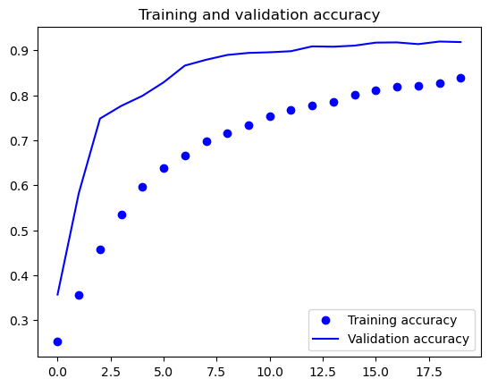
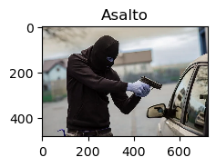
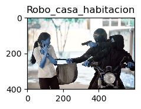
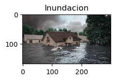
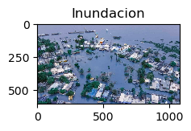
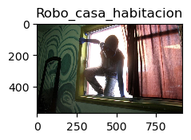
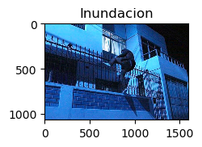
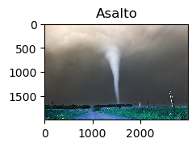
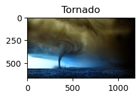

### Alumno: Axel Martin Vega Espinoza

# Detección de Situaciones de Riesgo con Redes Neuronales Convolucionales (CNN)

En este proyecto, se desarrolló una red neuronal convolucional (CNN) para detectar cinco situaciones de riesgo diferentes:

1. **Asaltos**
2. **Incendios**
3. **Inundaciones**
4. **Robos a casa o habitación**
5. **Tornados**

### Objetivo

El objetivo es entrenar una CNN utilizando imágenes etiquetadas de estas situaciones de riesgo. Se utilizaron técnicas de procesamiento de imágenes y aprendizaje profundo para lograr una buena precisión en la clasificación.

### Datos

Se recopiló un conjunto de datos diverso que incluía imágenes de cada situación de riesgo procedentes de videos. Luego, se prepararon y separaron los datos en conjuntos de entrenamiento y prueba.

### Implementación

Se utilizaron bibliotecas como TensorFlow y Keras para construir y entrenar la CNN.


## Resultados

Para cada categoría se recolectaron 5240 imágenes, y se dividieron en: 20% para pruebas y 80% para entrenamiento. Al probar el modelo con las imágenes de entrenamiento se obtuvo una precisión del 90% y una perdida de 30%.   



Yal tratar con las imágenes de prueba se obtuvo un rango de precisión de entre 84% a 99%.   

``` 
              precision    recall  f1-score   support

     Class 0       0.84      0.87      0.85      1014
     Class 1       0.99      1.00      1.00      1038
     Class 2       0.79      0.88      0.83      1049
     Class 3       0.95      0.88      0.91      1086
     Class 4       0.97      0.88      0.92      1053

    accuracy                           0.90      5240
   macro avg       0.91      0.90      0.90      5240
weighted avg       0.91      0.90      0.90      5240
```

Cuando se hizo la revisión de esta actividad por parte del profesor, se puso a prueba el modelo con las siguientes imágenes (Las predicciones de la CNN se muestran en la parte superior):     

1. **Asaltos**





2. **Inundaciones**





3. **Robos a casa o habitación**





4. **Tornados**






En todas las pruebas predijo de forma correcta 1 de las 2. Con la situación de riesgo que mejor se comportó fue con las inundaciones.